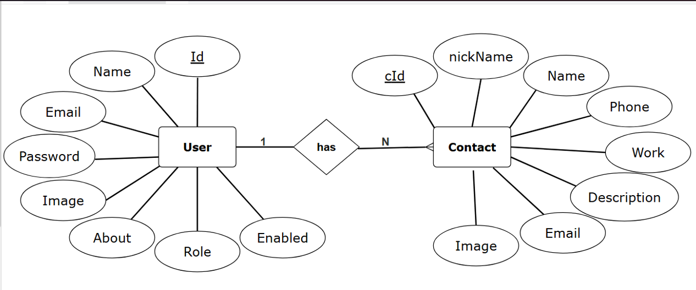

# Smart Contact Manager (SCM)

## Introduction

Smart Contact Manager (SCM) is a full-featured web application built using Spring Boot that allows users to manage their personal and professional contacts securely and efficiently. It provides a user-friendly interface for storing, updating, and organizing contact information, along with authentication and profile management features.

## Features

- User registration and login with secure password handling  
- Dashboard for managing contacts  
- Add, update, delete, and view contact details  
- Profile management  
- Forgot password recovery using email and OTP  
- Pagination for contact lists  
- Role-based access control  

## How It Works

SCM follows the MVC (Model-View-Controller) architecture:

- **Model**  
  Defines entities like `User` and `Contact` with JPA annotations.

- **View**  
  Uses Thymeleaf templates for rendering HTML pages.

- **Controller**  
  Handles HTTP requests and maps them to service logic.

- **Service Layer**  
  Contains business logic and interacts with the DAO layer.

- **DAO Layer**  
  Interfaces with the database using Spring Data JPA.

## Requirements to Set Up Spring Boot Project

### 1. Software Requirements

- Java Development Kit (JDK) 17 or higher  
- Maven (for dependency management and build)  
- MySQL (or any other relational database)  
- IDE (IntelliJ IDEA, Eclipse, or VS Code)

### 2. Installation Steps

#### Clone the Repository

```bash
git clone https://github.com/diyajn/smart-contact-manager.git
````

#### Configure the Database

1. Create a database named `smart_contact_manager`.
2. Update `application.properties` with your database credentials:

```properties
spring.datasource.url=jdbc:mysql://localhost:3306/smart_contact_manager
spring.datasource.username=your_username
spring.datasource.password=your_password
```

#### Build and Run the Project

```bash
mvn clean install
mvn spring-boot:run
```

#### Access the Application

Open your browser and navigate to:

```
http://localhost:8080
```

## Entity Relationship Diagram



## Contribution

Contributions are welcome. Feel free to fork the repository, raise issues, or submit pull requests to improve Smart Contact Manager.

